### Dom Heallis
## 040728287 
## Lab 1

# Task 1
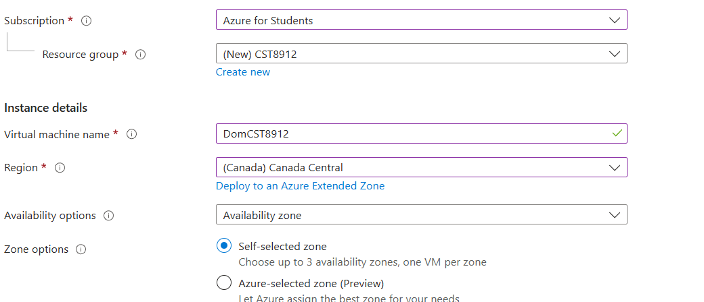
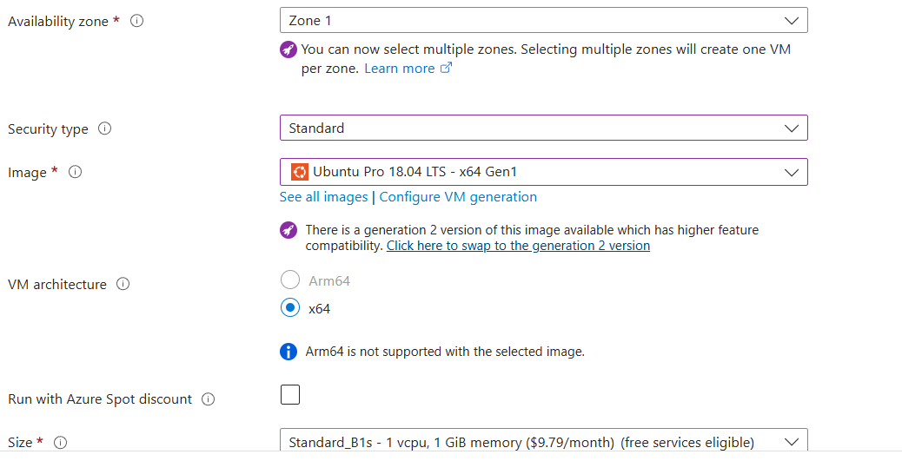
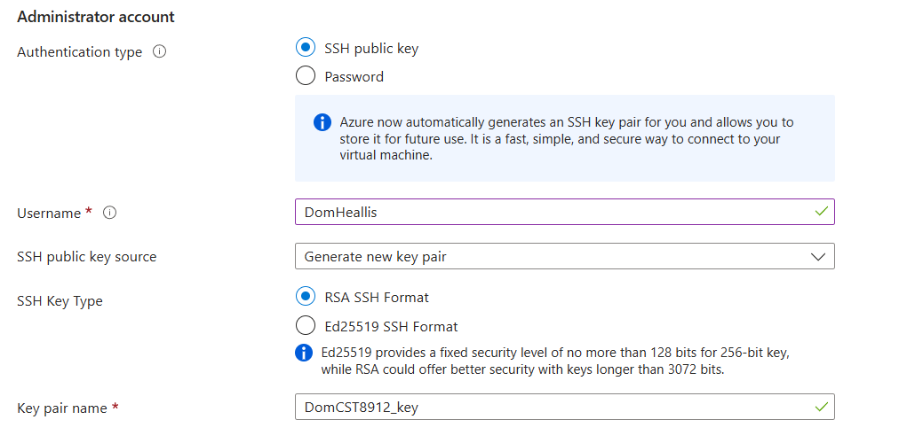

# Task 2

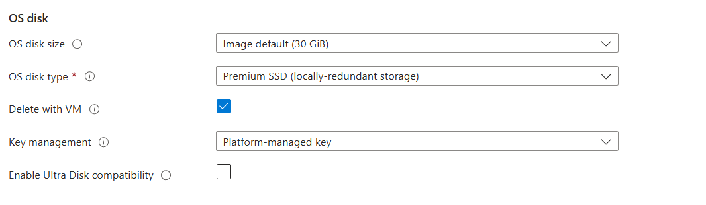

# Task 3

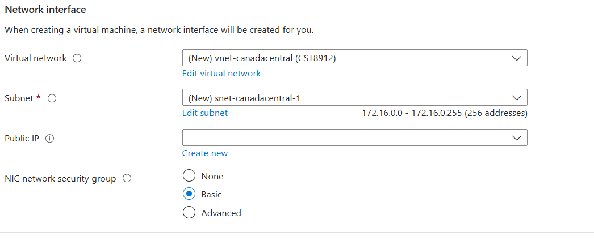

# Task 4
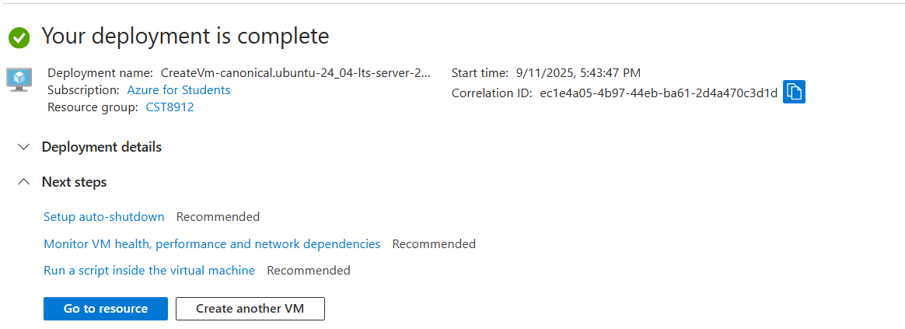

# Task 5
Start

Stop
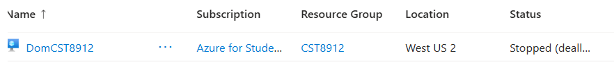

Restart
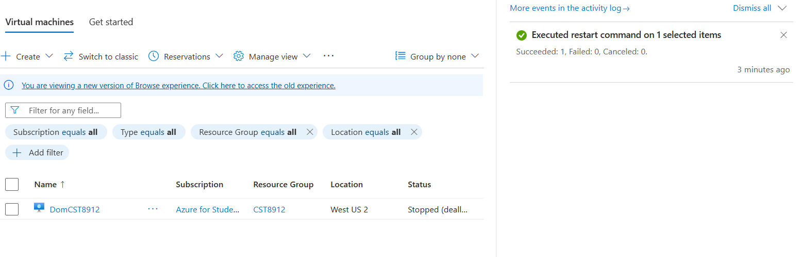

# Task 6

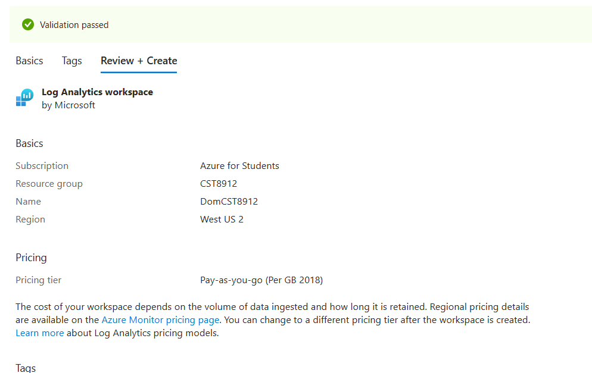

# Task 7

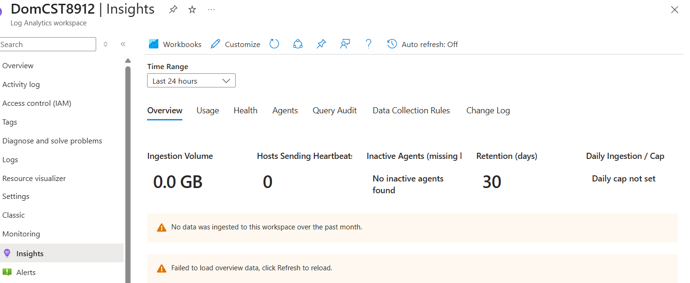

# Task 8
ssh
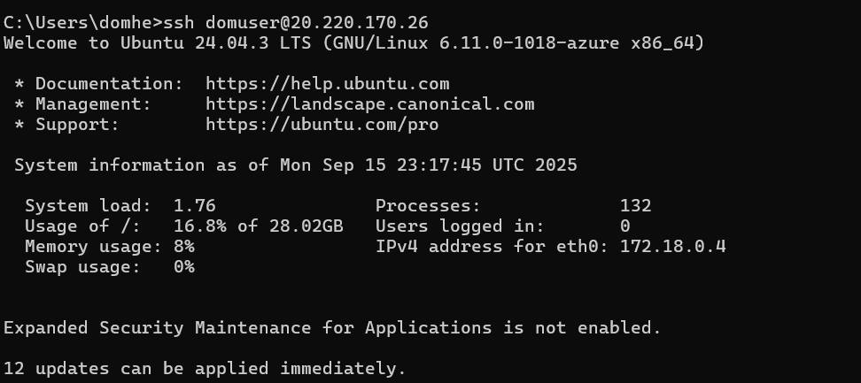

uname -a  / top
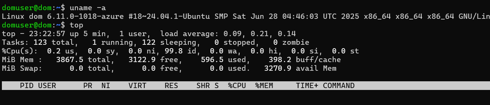

df -h
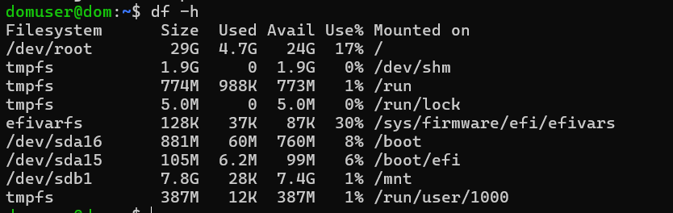

mkdir / ls -l
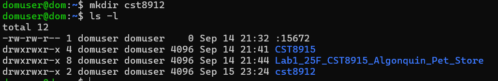
