### Dom Heallis
040728287

<strong>
Lab 2

---

## 1. Resource Group

## 2. Virtual Netowrks
vnet0
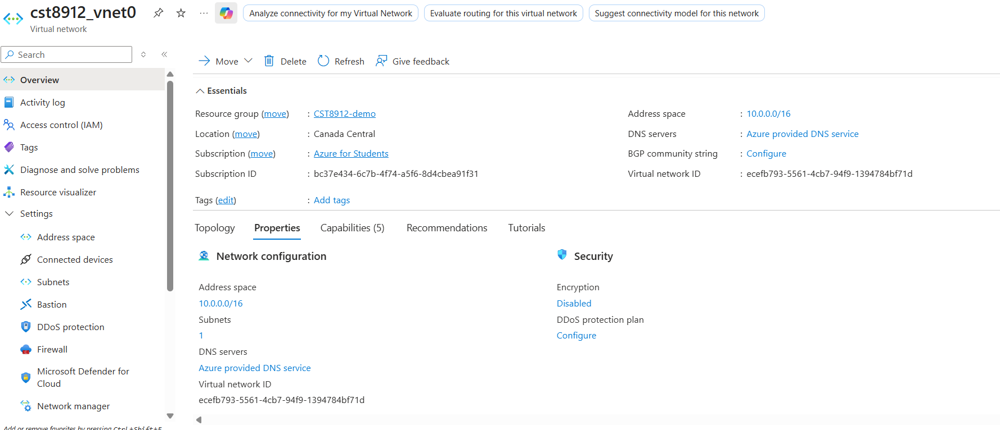

vnet1
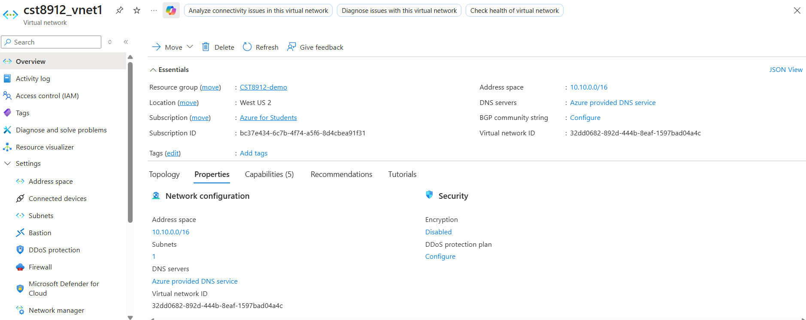

vnet2
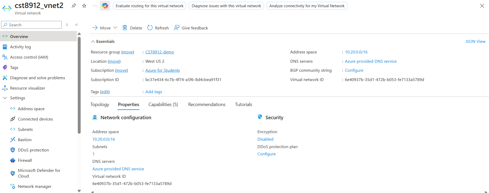

## 3. Review VNet configs
vnet0

vnet1

vnet0

## 4. Configure Peerings
vnet0 -> vnet1, vnet2
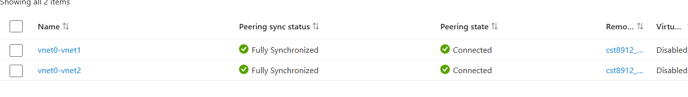

vnet1 -> vnet2

## 5. Deploy Virtual Machines
VM0
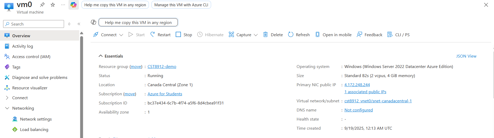

VM1
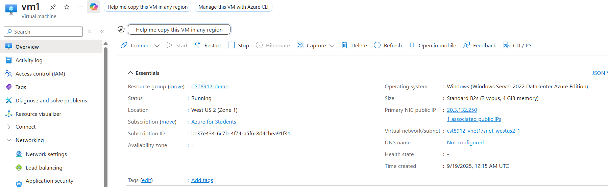

VM2
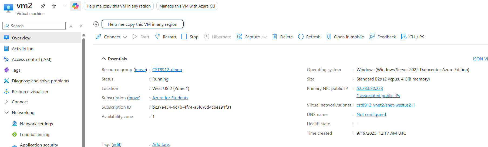

## 6. Verify Connectivity
VM0 -> VM1
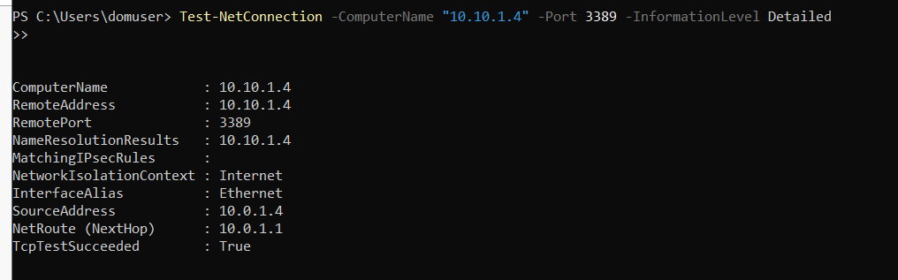

VM0 -> VM2
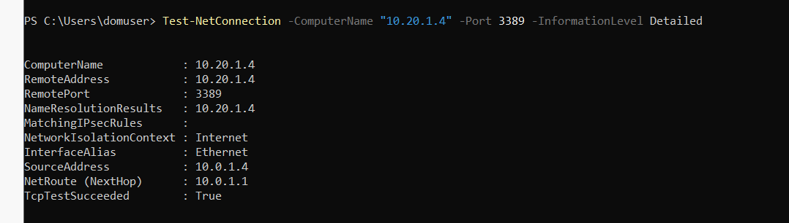

VM1 -> VM2
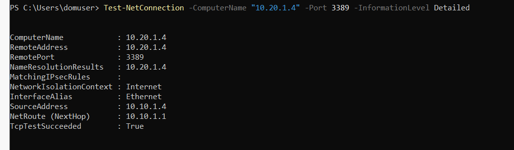

## 7. Delete Everything
Resource Group
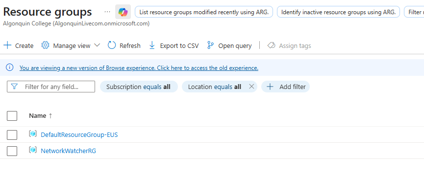

VMs

VNets
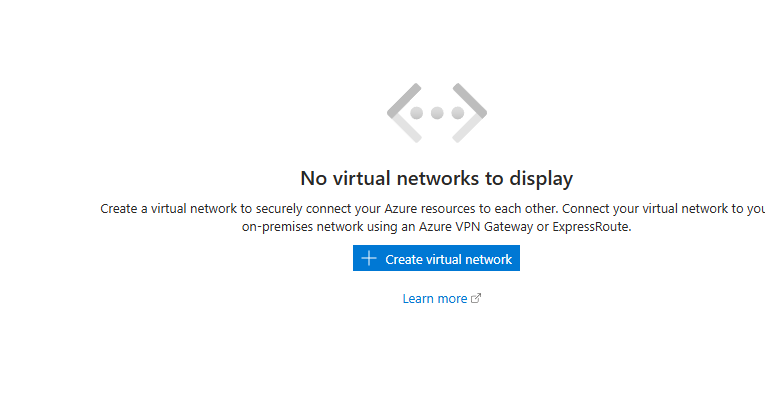

# Findings & Analysis

## Why is  VNet peering important?
It allows different virtual networks to talk to each other directly, very useful when you have multiple applications or environments that need to share data like a web application connecting to a database on another network. It also adds security because the traffic doesn't require to go through the public internet where attacks can happen.

## How was the private IP communication established
Private IP communication was possible because of the peerings we set up in the Azure Virtual network section. When we peered these networks together, it allowed the VM's to communicate. Peering is like a bridge between VM's that can only be used by the VM's in that peering using their private IP.

## Benefits of global peering (performance & security)
Globabl VNet peering was useful in this lab because it let the VNets in different regions talk to each other. It establishes a private connection using their private IPs and significantly improves their connection with lower latency. It is much safer because from what I understand, the data never leaves the Azure controlled environment which makes it less vulnerable to attacks.
