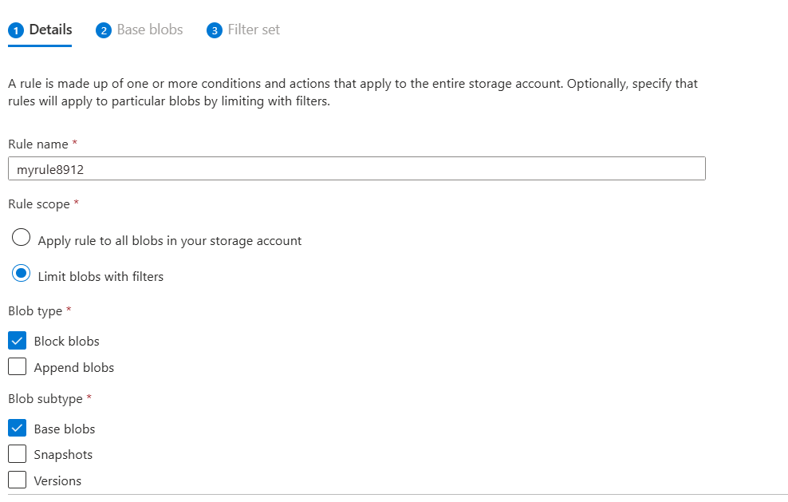

### Dom Heallis
### 040728287

## Lab 3

---

# 1. Create Storage Account

# 2.	Use the resource group CST8912-demo.

# 3.	Select Canada Central as the region.

# 4.	Choose Geo-redundant storage (GRS).

# 5.	Keep networking and data protection options as default.

# 6.	Modify Redundancy and Access Tier
# 7.	Go to your storage account → Data Management → Redundancy
# 8.	Change redundancy from Geo-redundant (GRS) to Local redundant (LRS).

# 9.	Under Configuration, set Blob access tier to Cool, then save.

# 10.	Create Container and Upload Blob
# 11.	Under Data Storage, click Containers → create a container named labtestcontainer8912.
# 12.	Upload a blob into folder sampletest8912.
# 13.	Change Advanced Settings → Access Tier to Hot

# 16. Copy the blob url and very it does not work

# 17. I have access to it in an incognito window by generating SAS url

# 26.	On the container blade, under Data Management → Lifecycle Management, create a new rule: Rule Name: myrule8912
# 27.	Scope: Limit blobs with filters -- Blob type/subtype: Default

   

