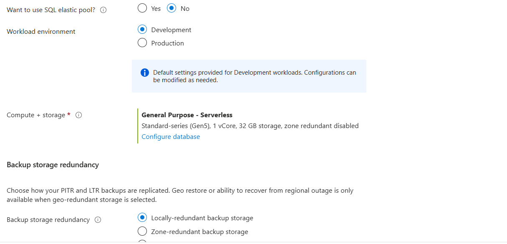
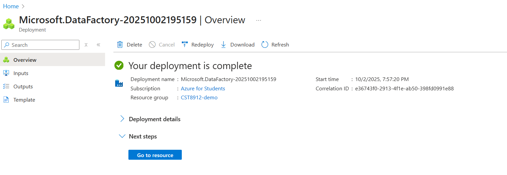

### Dom Heallis
### 040728287

## Lab 4
---
# 1 and 2. Create db with proper configs

# 3. Networking

# 4. Security

# 5. Additional settings

# 6. Review and Create

# 7. Query Editor login

# 8. Expand Tables

# 9. Run Query

# 10. Create Storage Account

# 11. Create Container

# 12. Create a new resource in your resource group from the azure portal, search for azure data factory with the following configuration, keeping git configuration, networking, advanced as default

# 13. Launch Azure data studio

# 14. Choose ingest data

# 15. Choose built in, and run once now

# 16. Configs for connection

# 17. Choose SalesLT product from drop down

# 18. Preview Data

# 19. File path

# 20. configs

# 21. Copying data

