# Dom Heallis - 040728287
# Lab 8

## Task 1 - Assign Tags via the Azure portal

created resource group
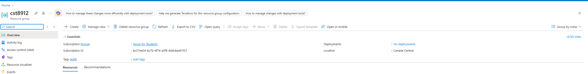

created new tags
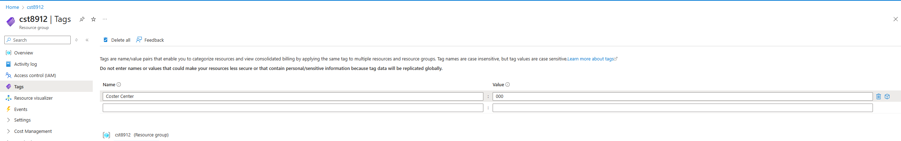

## Task 2 - Enforce tagging via an Azure policy

policy definitions
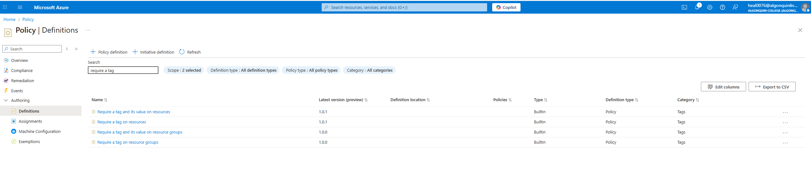

configs for scope
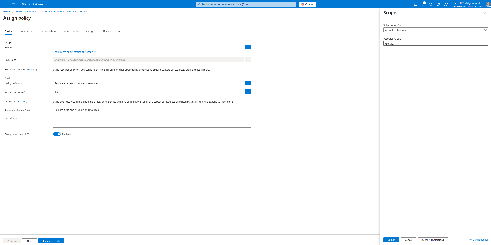

basic properties
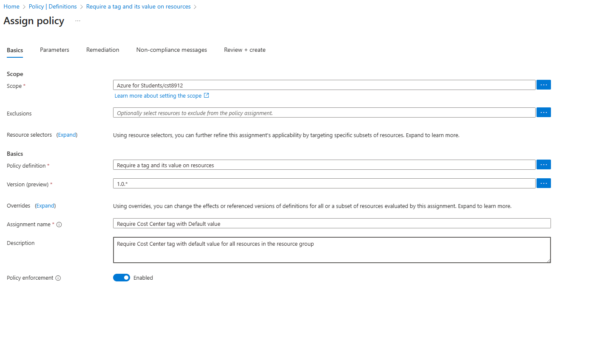

parameters
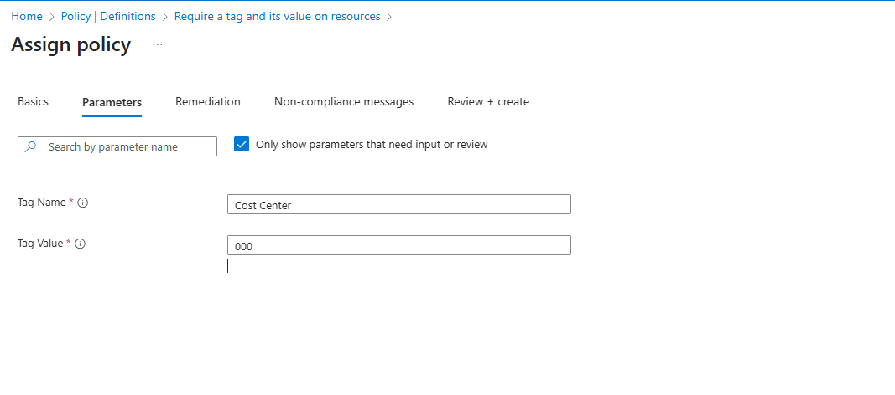

remediation tab

overall policy
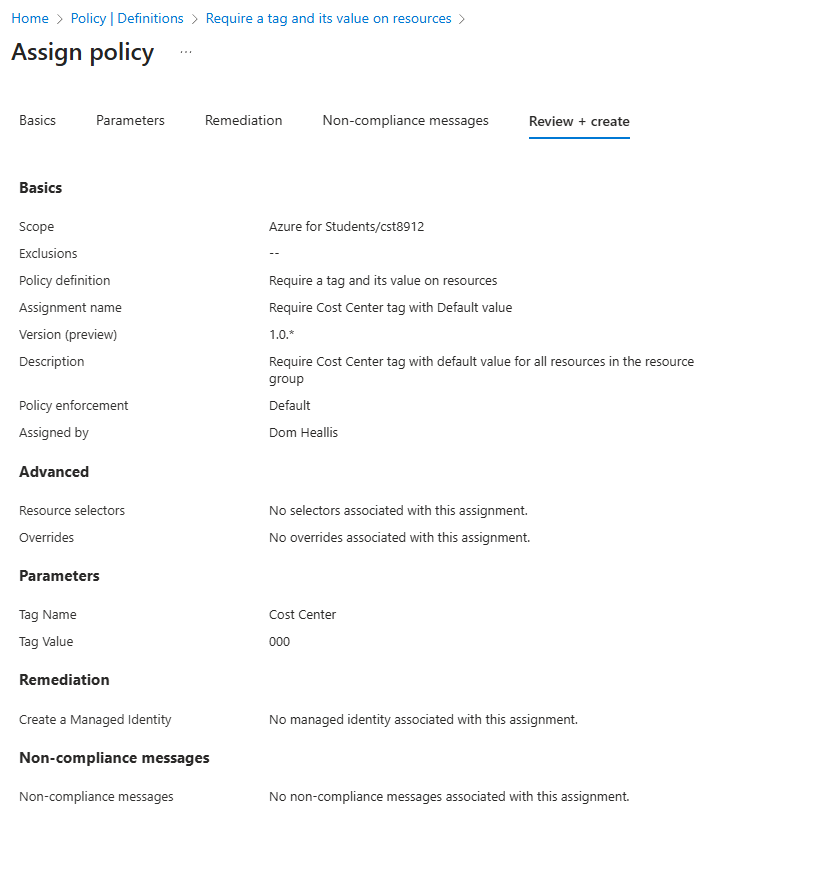

attempting to create storage account
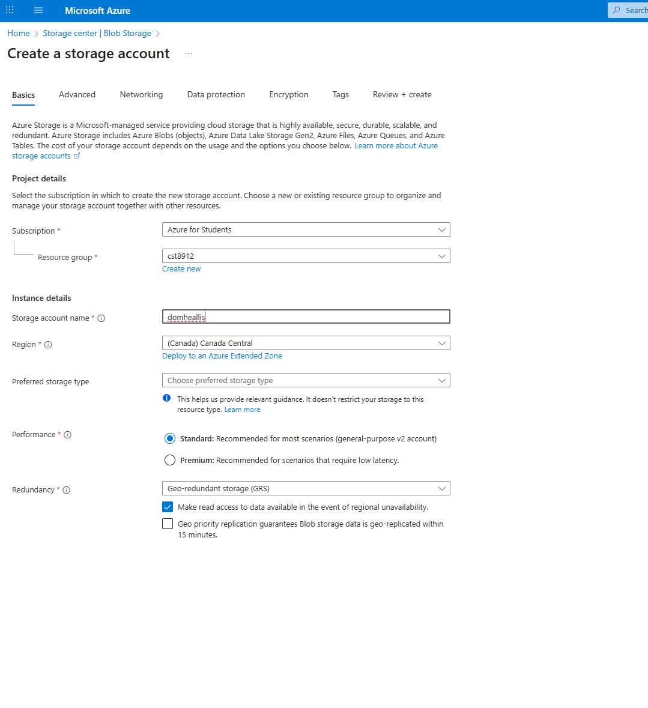

validation failed
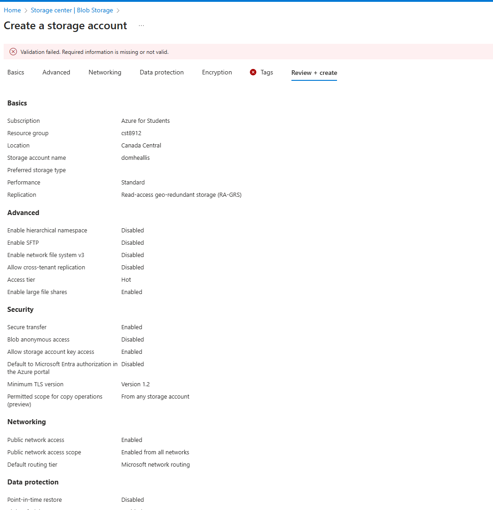

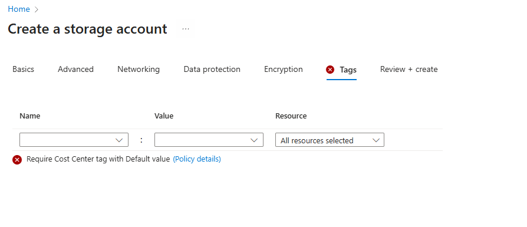

## Task 3 - Apply tagging via an Azure Policy
 
 deleting old policy
 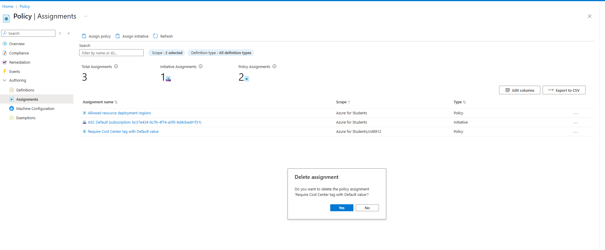

 new policy basic configs
 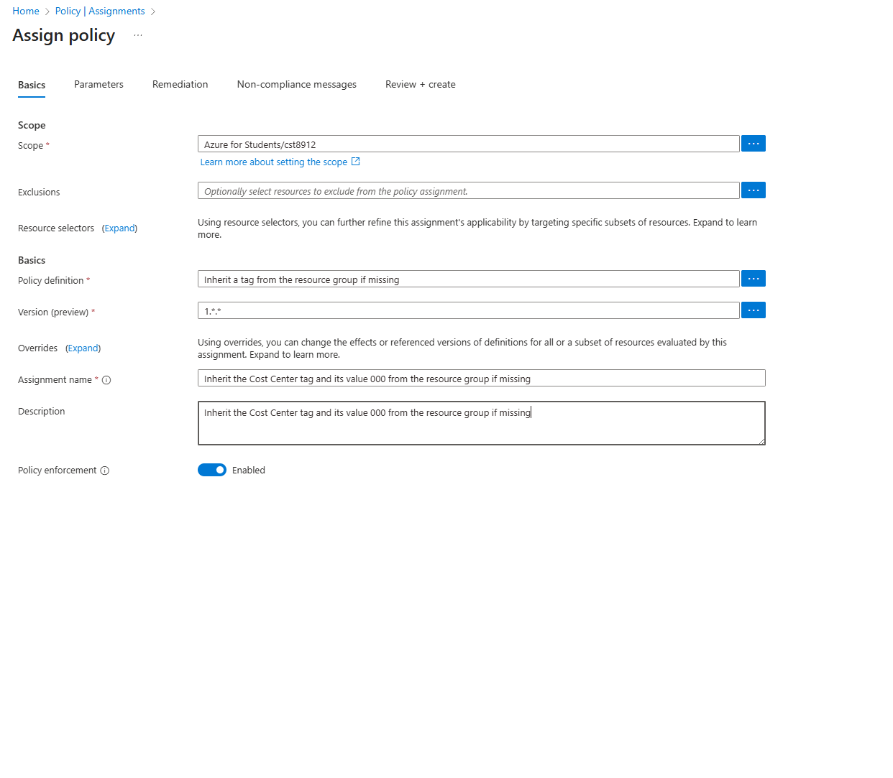

 parameters tab
 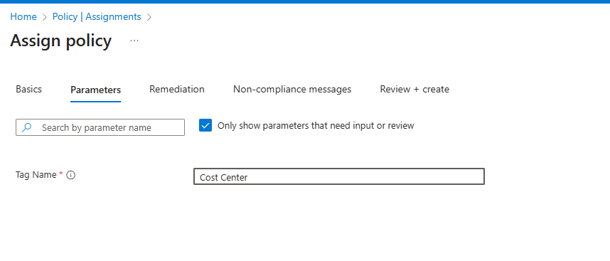

 remediation tab
 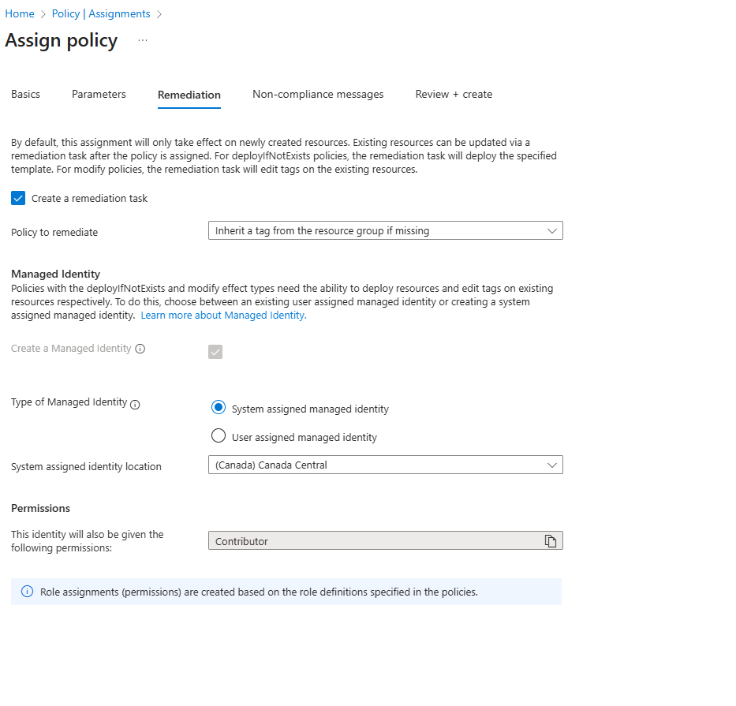

 overall configs
 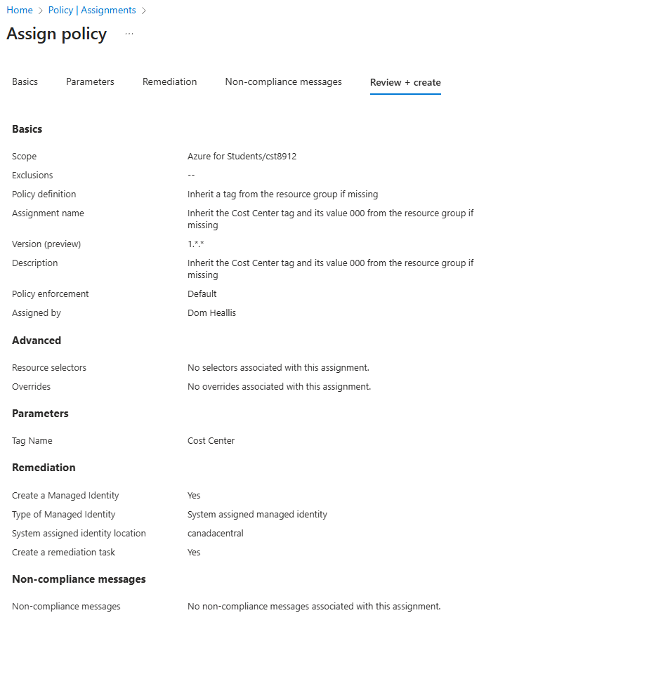

 creating storage account without tags but it has been automatically applied
 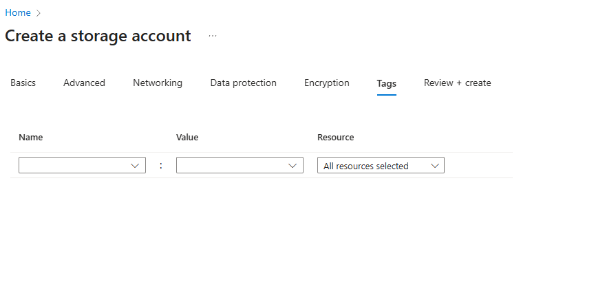

 tags applied
 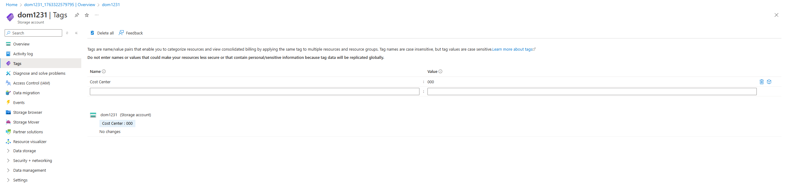

 ## Task 4: Configure and test resource locks

 created lock for delete
 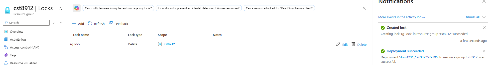

 can't delete resource group
 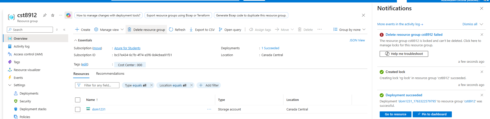

 ## Task 5: clean up resources

 Have to remove the lock before deleting
 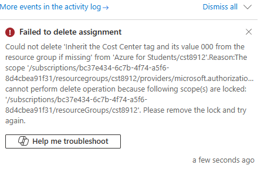

 locks gone
 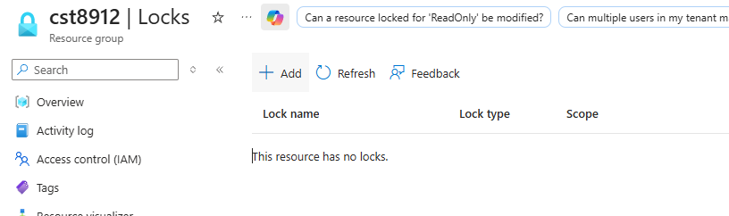

 assignment gone
 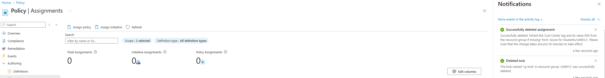

 storage gone
 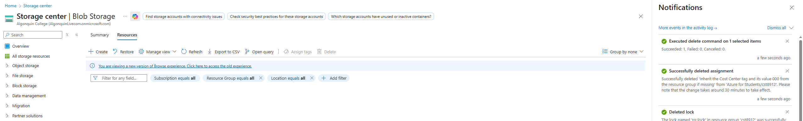

 tags gone
 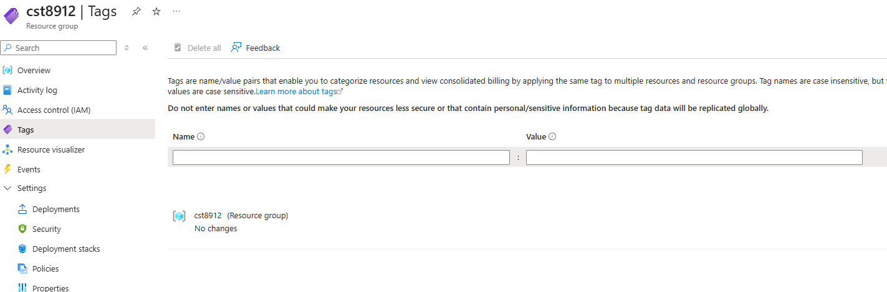

 resource group gone
 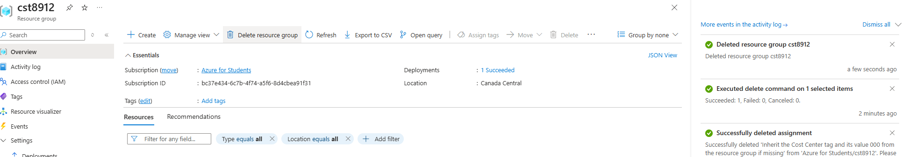

 

