# Dom Heallis - 040728287
# Lab 10

## Task 1 - Query SQL DB and Send Alert emails

logic app created
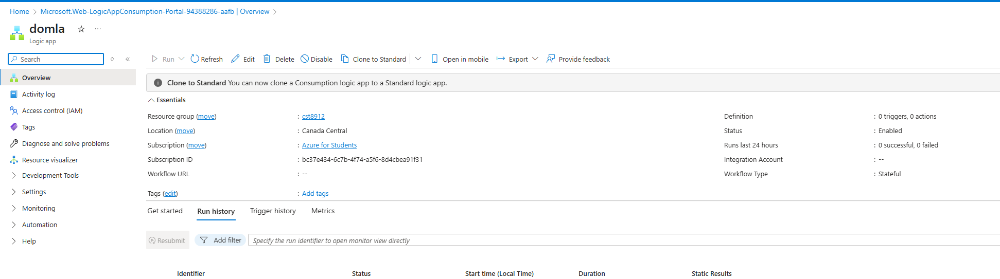

db/dbserver created
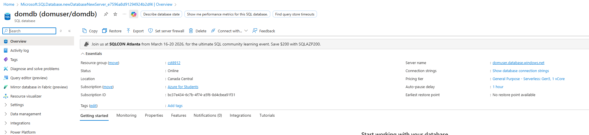

created table
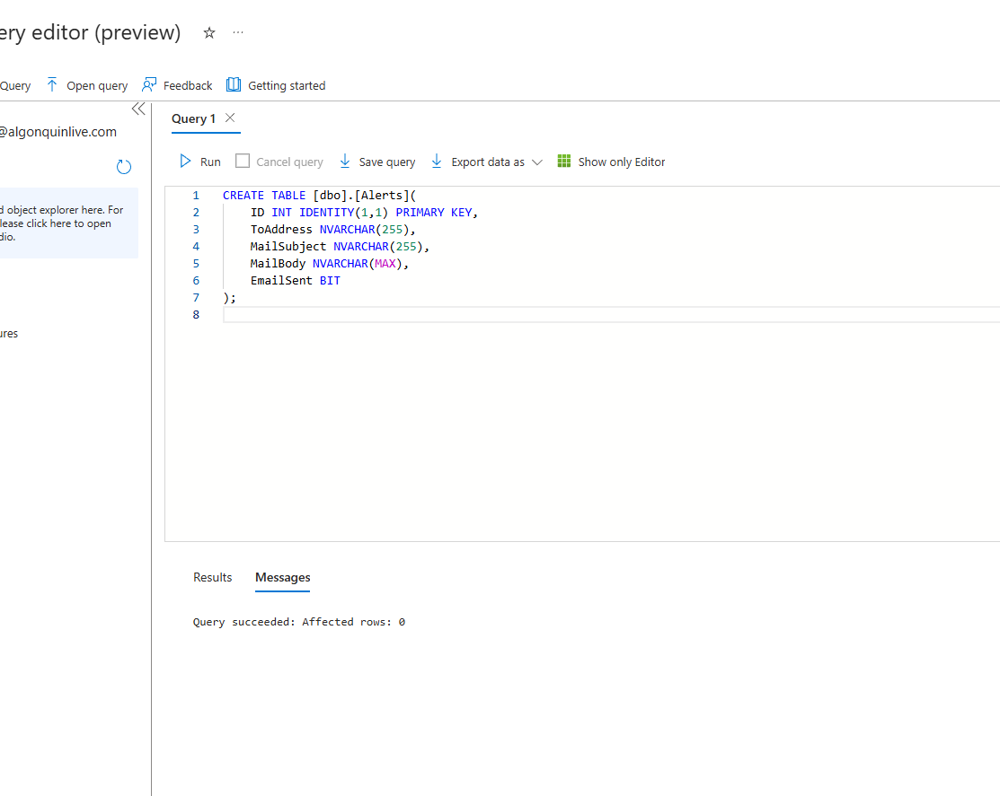

inserted sample alert records
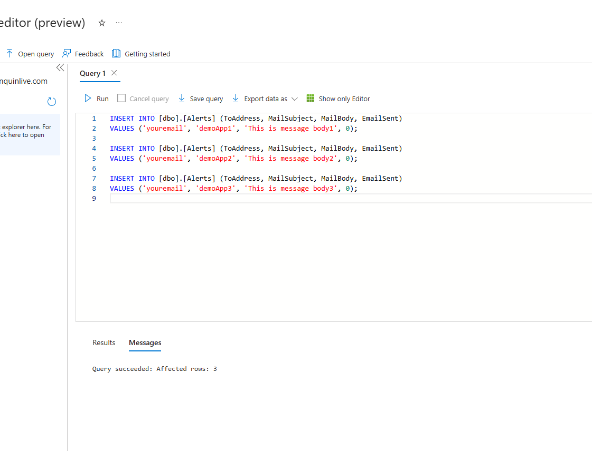

validating data

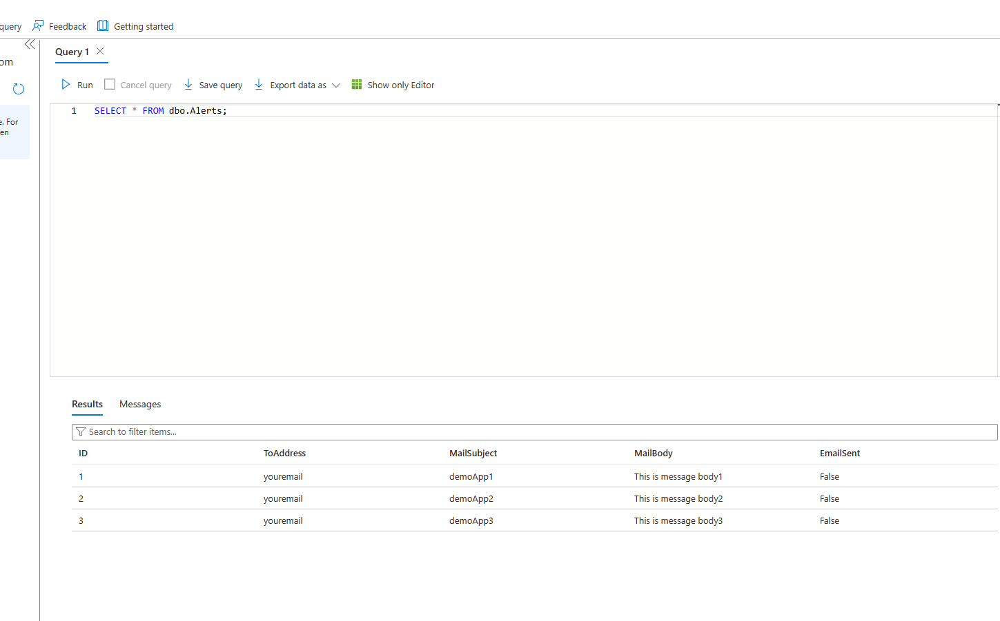

Added my email to it
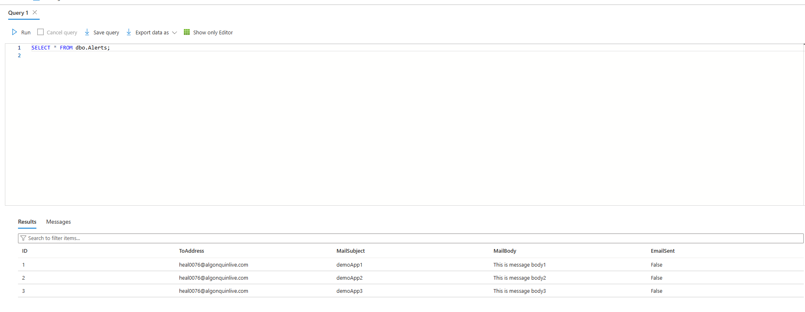

created reccurence every 3 minutes + get rows
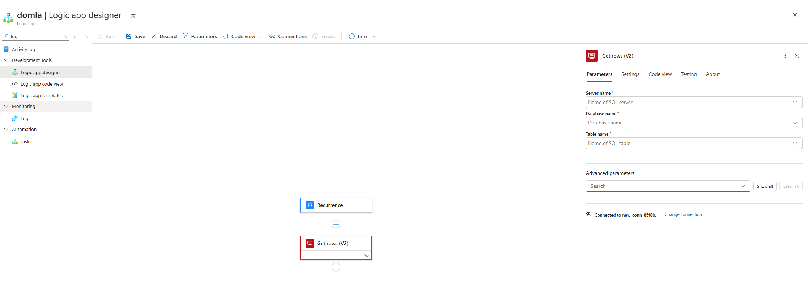
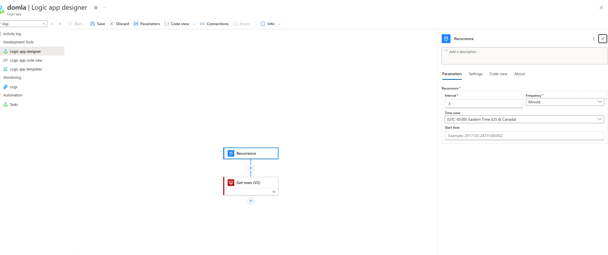

Loop through each alert, and send an email using dynamic content
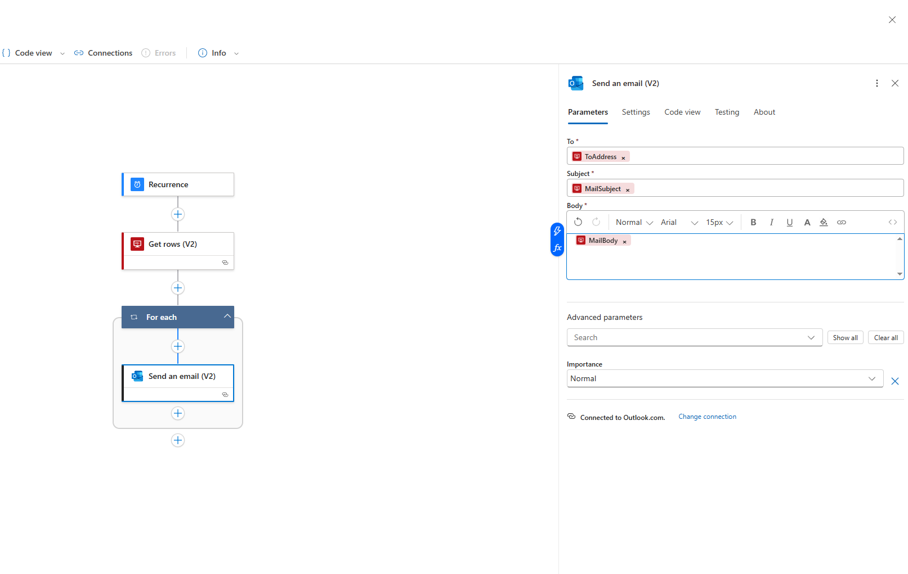

emails where sent
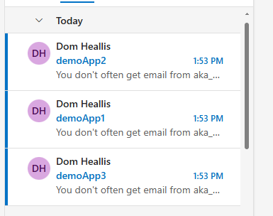
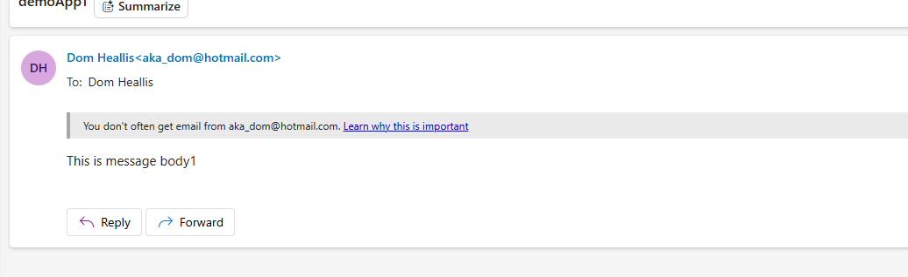

## Task 2 

storage account + container created
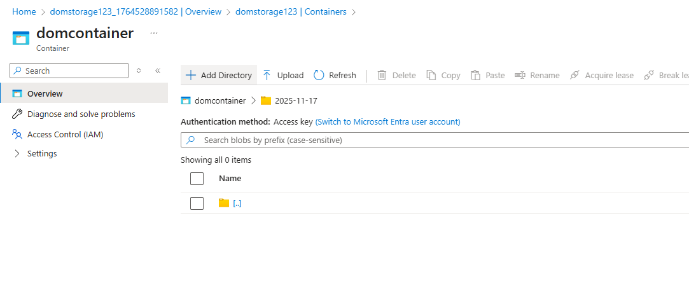

reccurence at 6pm everyday

sends an email after it has failed

email succesffuly sent
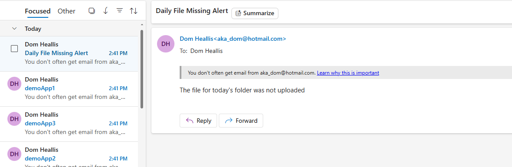

## Task 3 - Monitoring

runs history
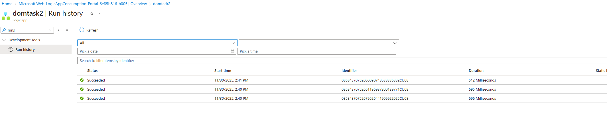

diagnostic settings
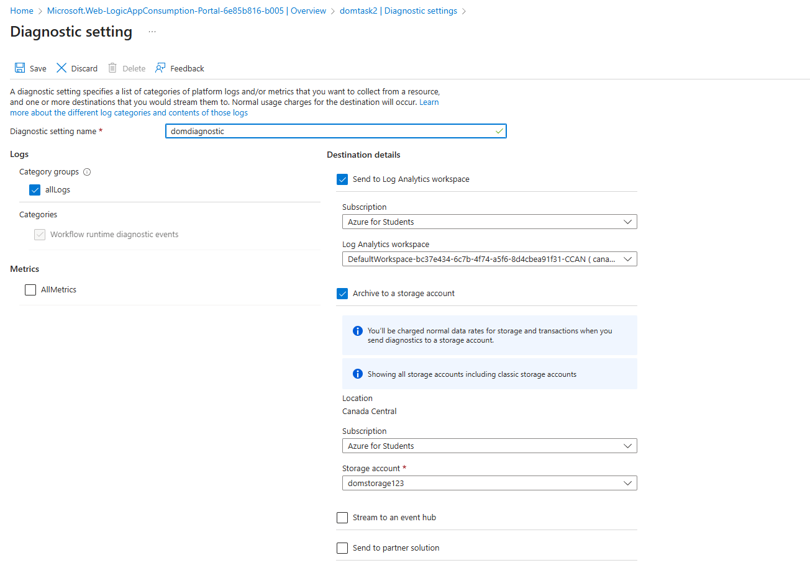

## Task 4 - delete

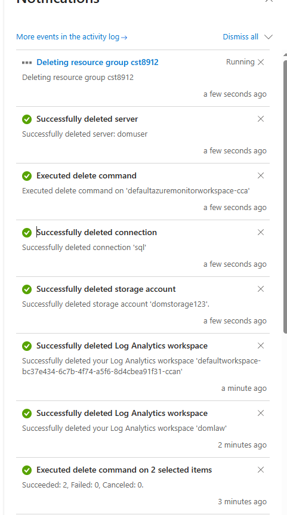

