# Dom Heallis - 040728287
# Lab 7

## Task 1 

Successful template deployment with resources
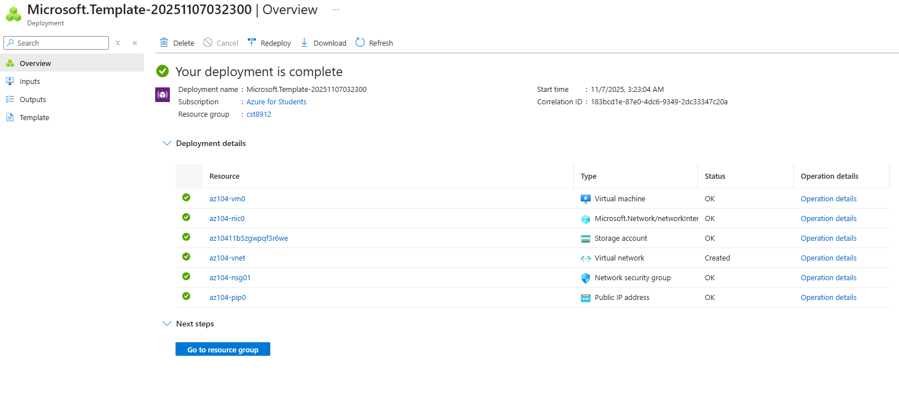

VM is being monitored
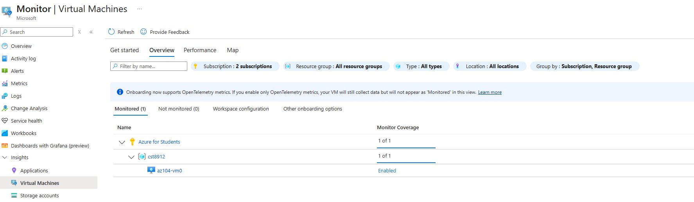
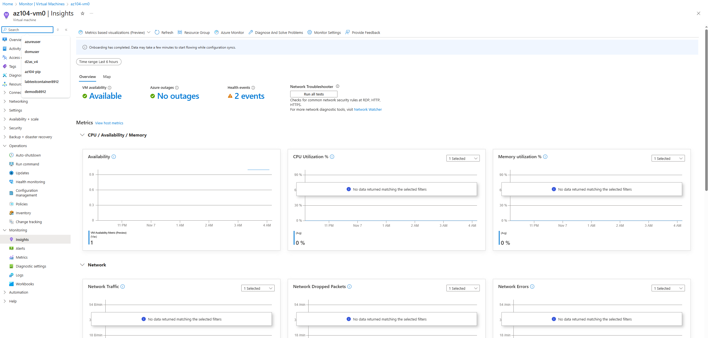

## Task 2

chosing the resource group
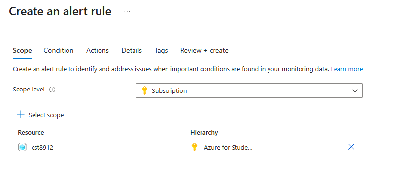

creating alert rule
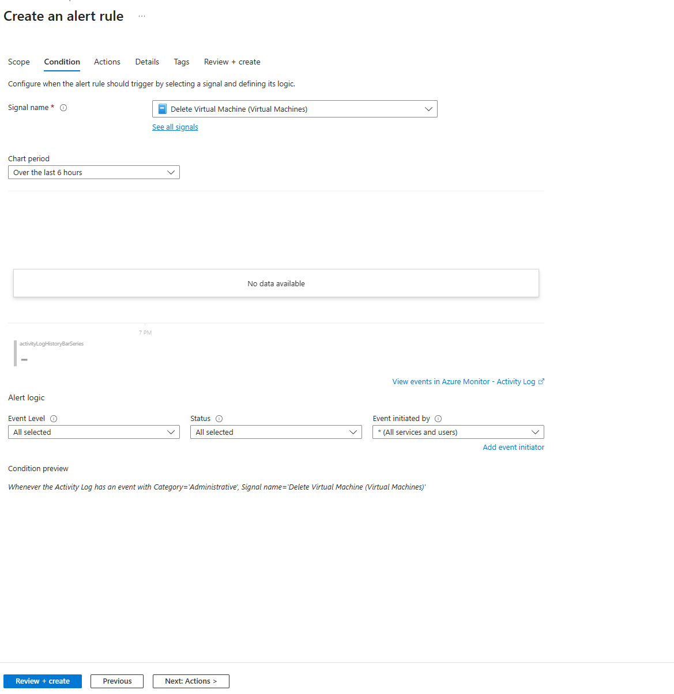

## Task 3

Creating action group configs
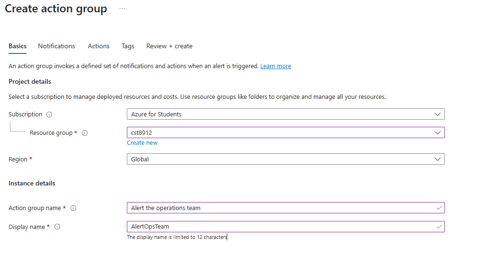

email settings
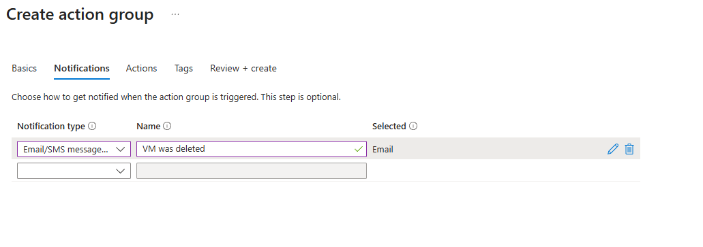

Alert rule details tab
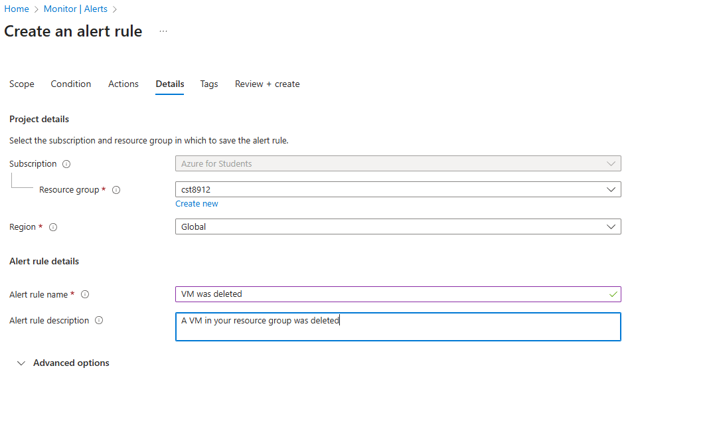

## Task 4

right before deleting
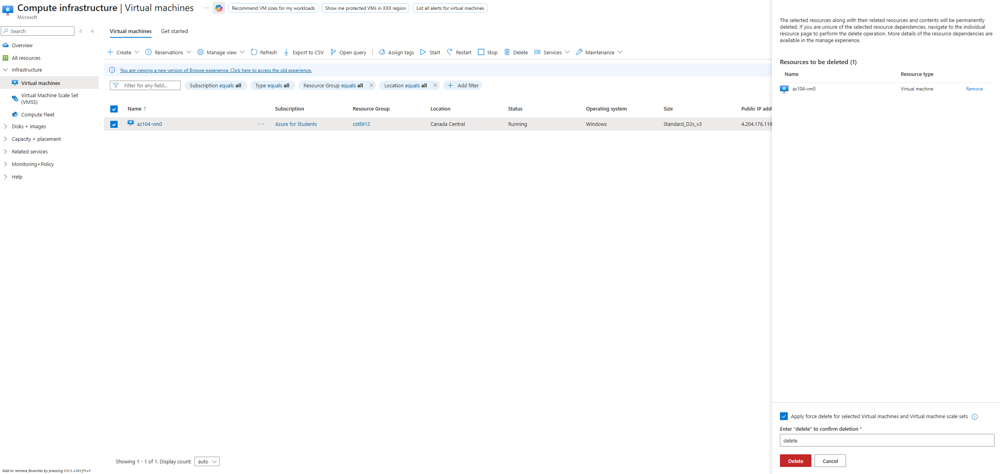

email alart
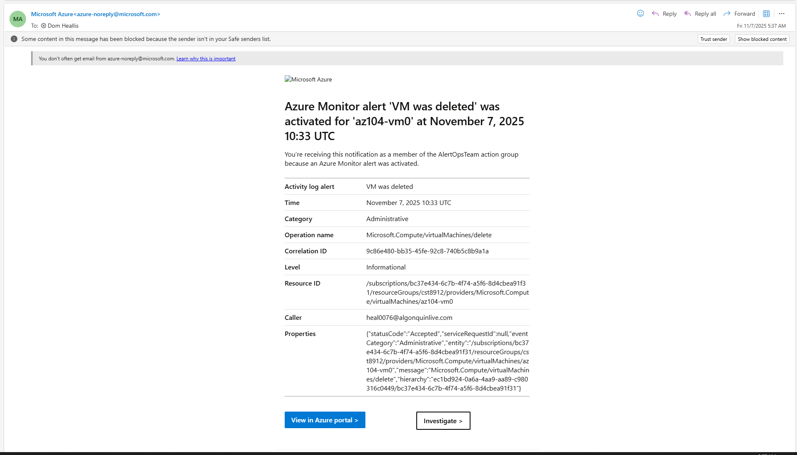

confirmation on azure
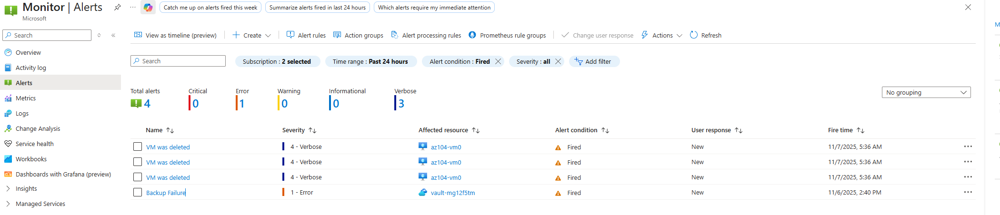

details
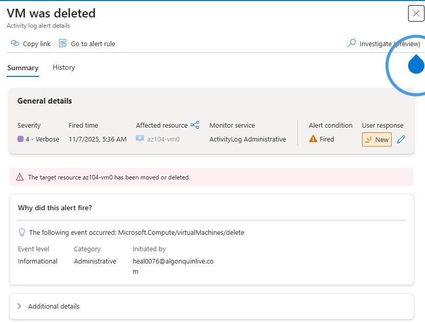

# Task 5
creating processing rules
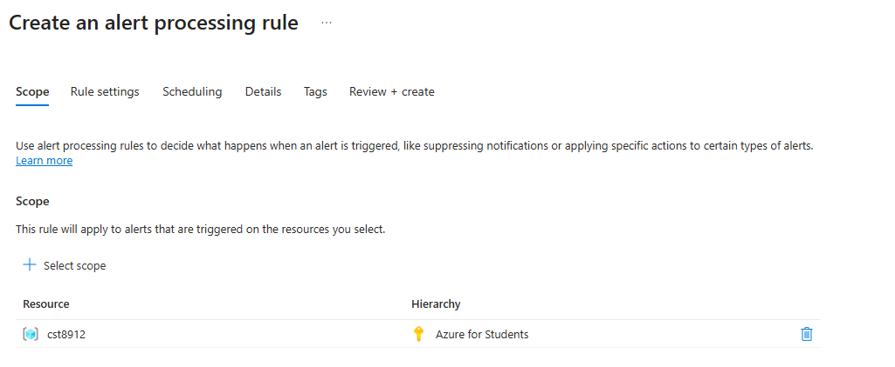

supress notifications

configs for supress notifications
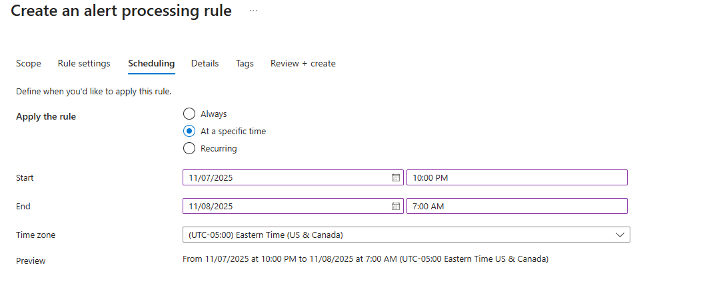

details tab
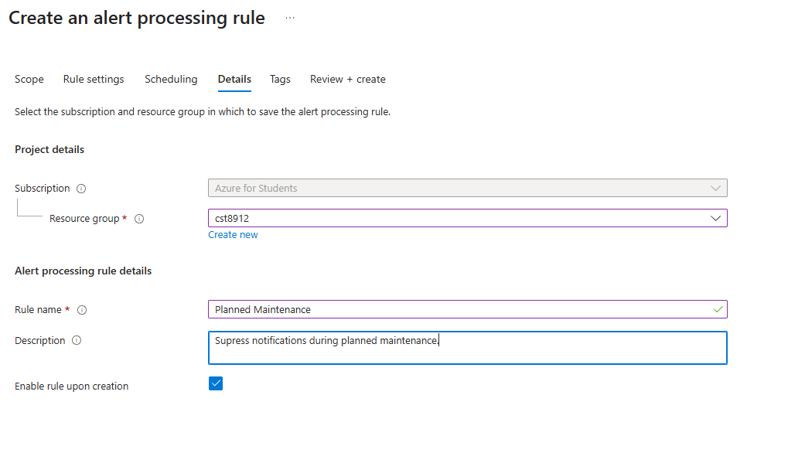

created
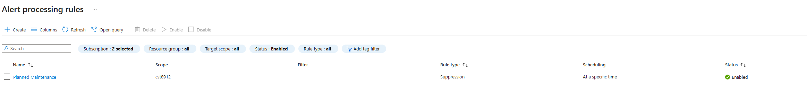

# Task 6
selecting scope
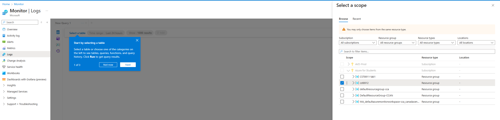

running the heartbeat count query
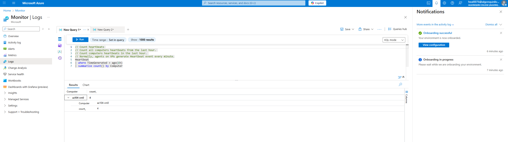

running the new inisghts metric query
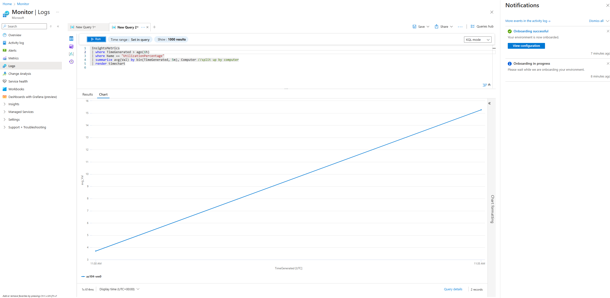