# Dom Heallis - 040728287
# Lab 9

# Task 1 - Create SQL DB

Basic configs
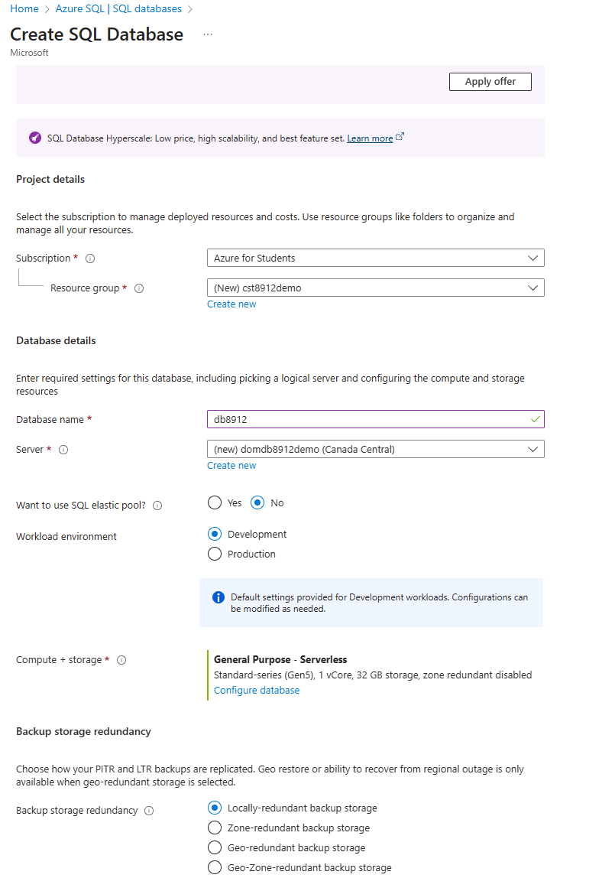

networking configs
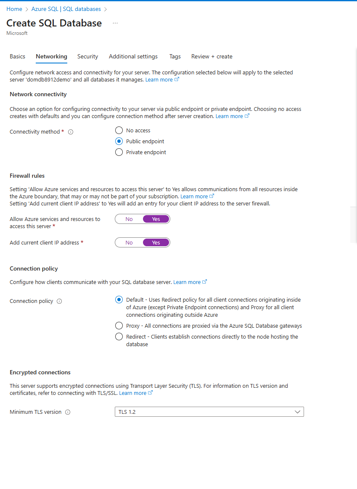

security
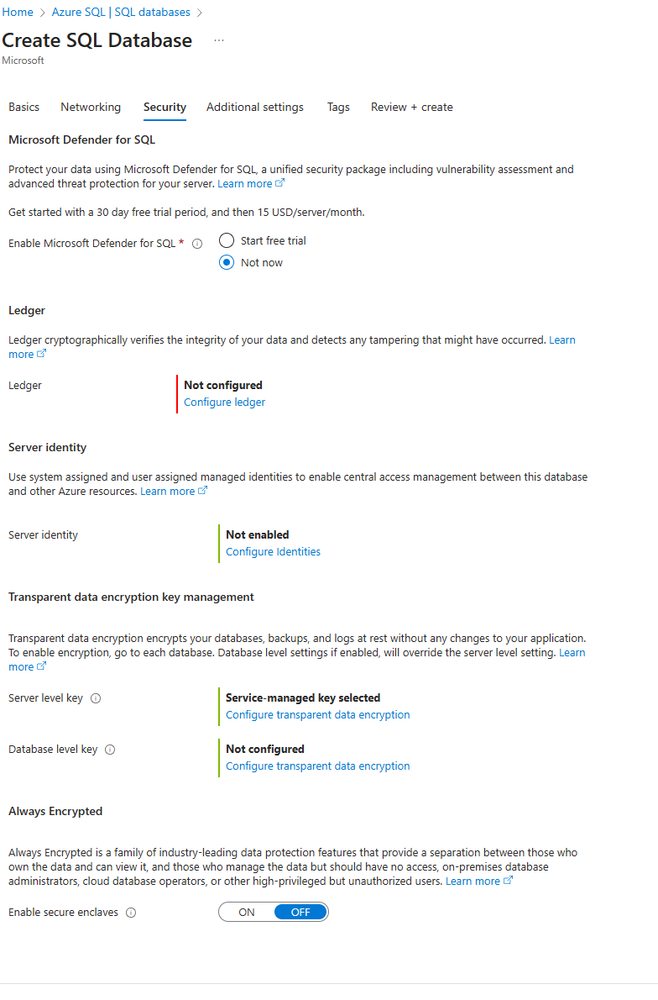

additional settings
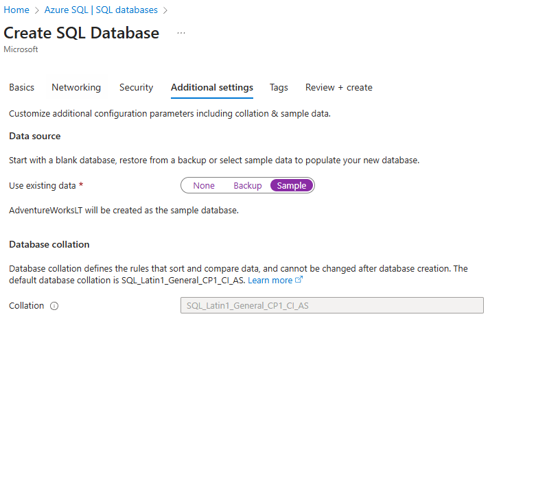

all of them
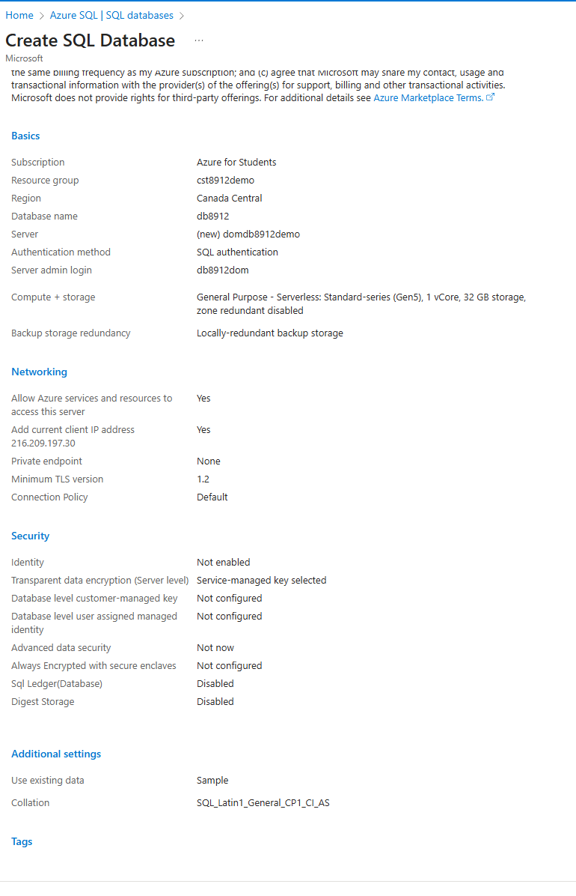

Created successfully
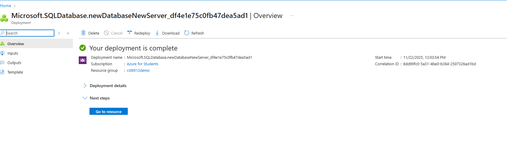

# Task 2 - Configure Advanced Data Protection

microsoft defender for cloud enabled
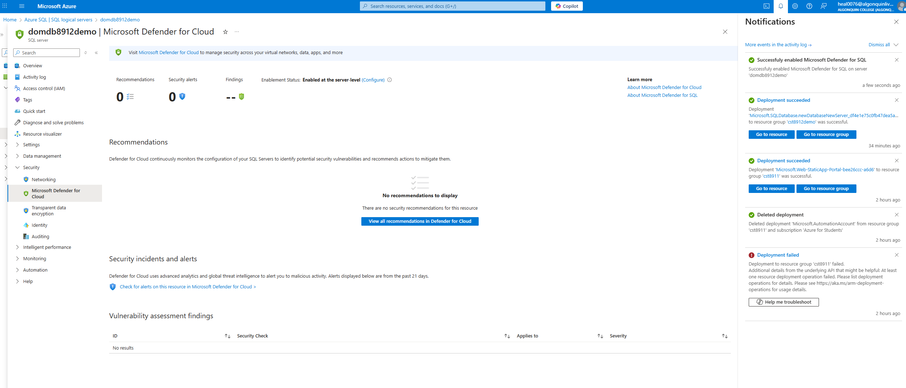

configs
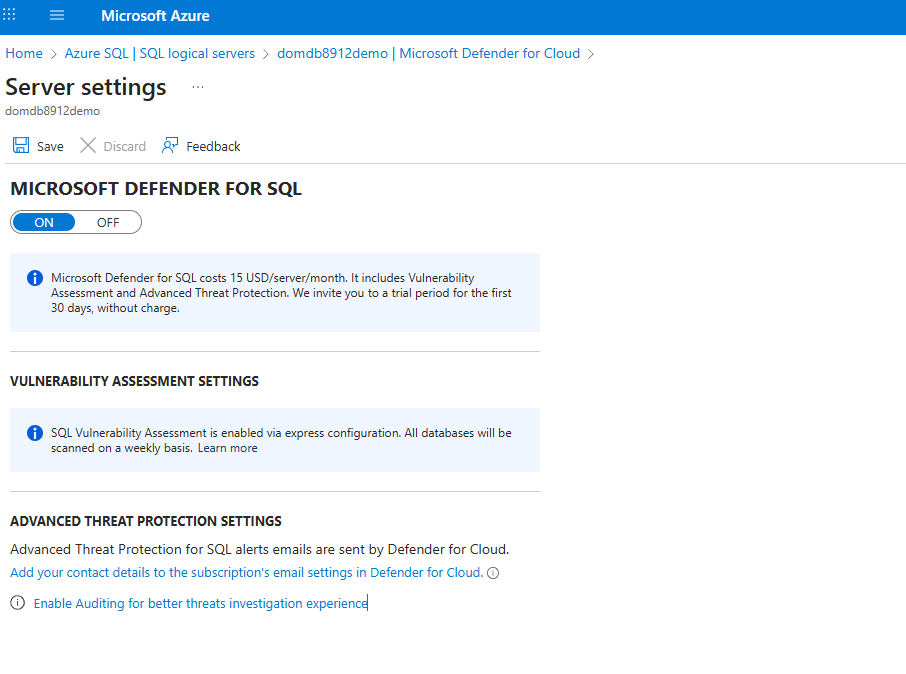

recommendations
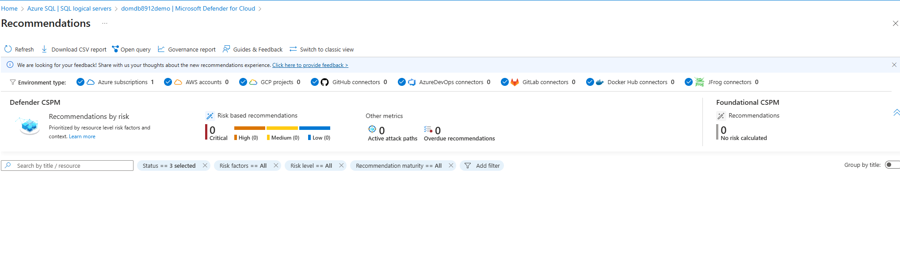

# Task 3: Configure Data Classification

text with 15 columns
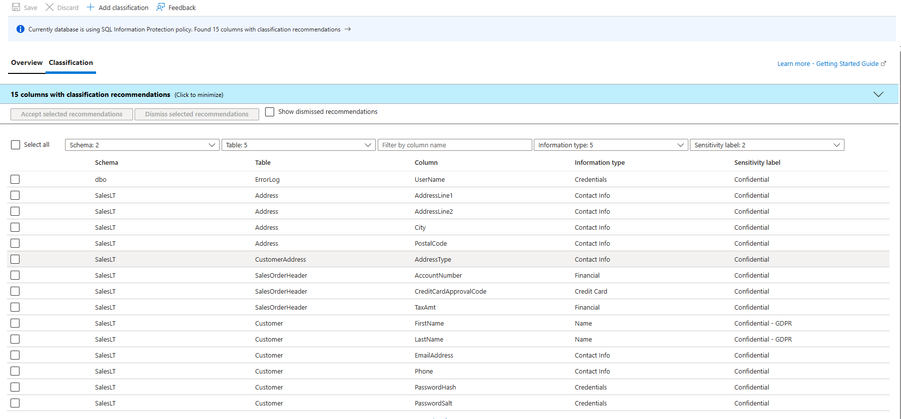

selected all and accepted
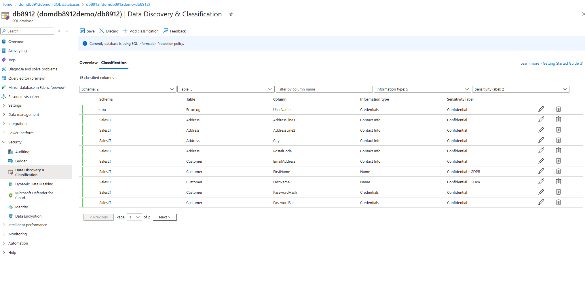

classification information
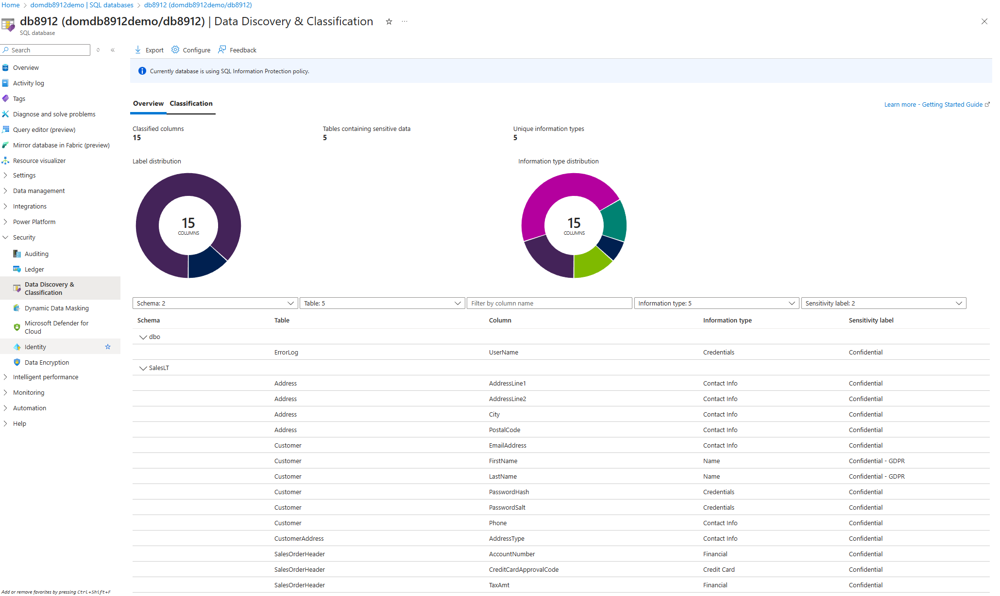

# Task 4: Configure Auditing

audit configs
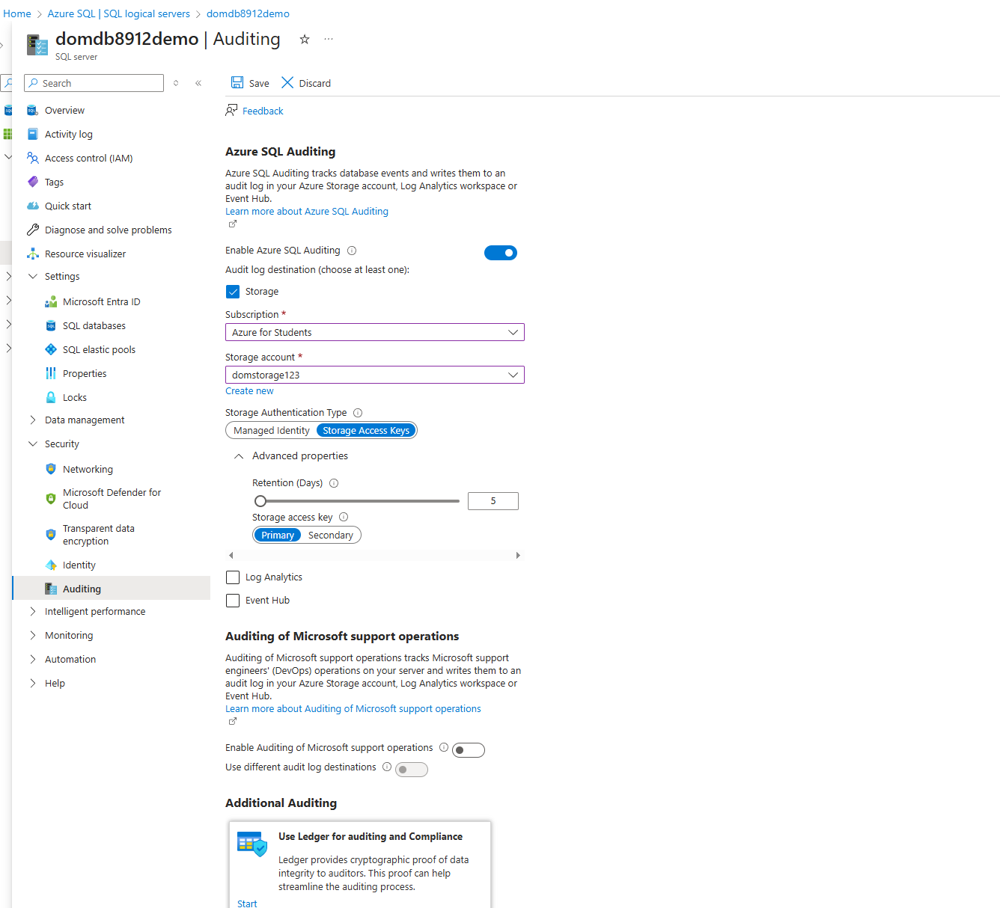

db server level auditing enabled
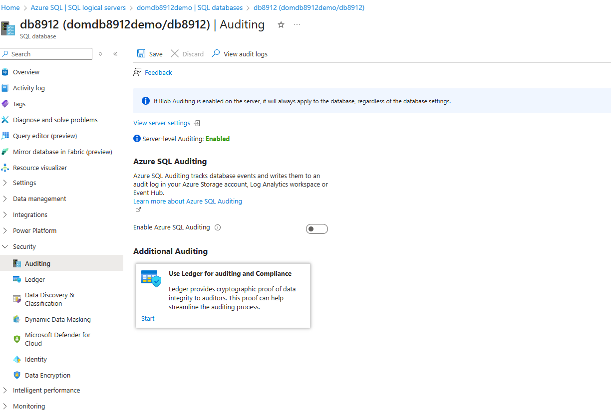

basic query
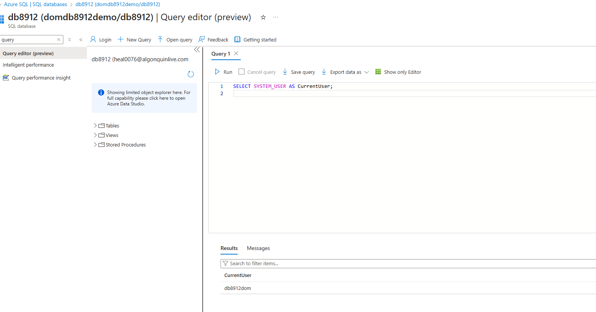

audit logs
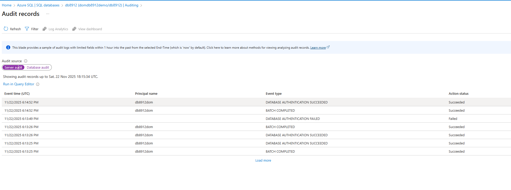

# Task 5: Delet everything

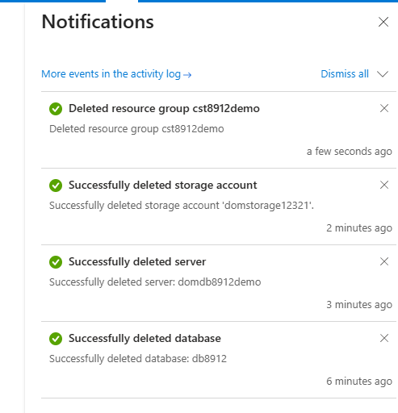